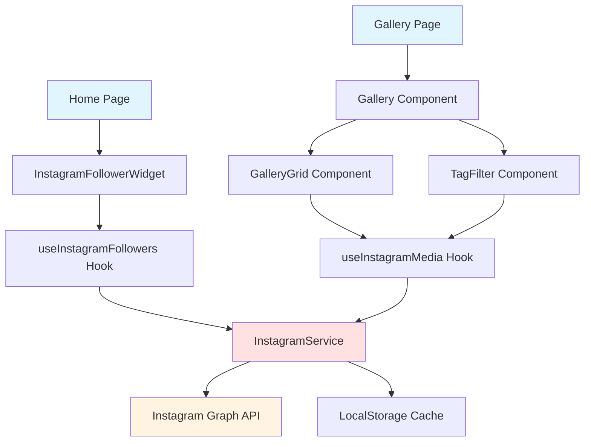

# Design Document: Instagram Feed Integration

## Overview

This design document outlines the technical approach for integrating Instagram content into the Goonj Luminance application. The integration will display Instagram images with tag-based filtering in the Gallery page and show live follower count on the Home page. The solution leverages Instagram's Graph API and implements a clean separation of concerns with dedicated services, hooks, and UI components.

### Key Design Principles

- **Separation of Concerns**: API logic, state management, and UI rendering are separated into distinct layers
- **Reusability**: Instagram API client can be used across multiple components
- **Performance**: Implement caching, lazy loading, and optimistic UI updates
- **Error Resilience**: Graceful degradation when API calls fail
- **Type Safety**: Full TypeScript support throughout the implementation

## Architecture

### High-Level Architecture



### Data Flow

1. **Initial Load**: Components mount and trigger custom hooks
2. **API Request**: Hooks call InstagramService methods
3. **Cache Check**: Service checks localStorage for cached data
4. **API Call**: If cache is stale/missing, fetch from Instagram Graph API
5. **Data Transform**: Raw API response is transformed into application models
6. **State Update**: Hooks update component state with transformed data
7. **UI Render**: Components render with new data
8. **Background Refresh**: Periodic updates refresh data every 5 minutes

## Components and Interfaces

### 1. Instagram Service Layer

**File**: `src/services/instagram.service.ts`

The Instagram service encapsulates all Instagram Graph API interactions and provides a clean interface for the rest of the application.

```typescript
interface InstagramConfig {
  accessToken: string;
  userId: string;
  apiVersion: string;
}

interface InstagramMediaItem {
  id: string;
  mediaType: 'IMAGE' | 'VIDEO' | 'CAROUSEL_ALBUM';
  mediaUrl: string;
  permalink: string;
  caption?: string;
  timestamp: string;
  thumbnailUrl?: string;
}

interface InstagramUserProfile {
  id: string;
  username: string;
  followersCount: number;
  mediaCount: number;
}

interface CachedData<T> {
  data: T;
  timestamp: number;
  expiresAt: number;
}

class InstagramService {
  private config: InstagramConfig;
  private baseUrl: string;
  private cachePrefix: string = 'instagram_cache_';
  
  constructor(config: InstagramConfig);
  
  // Fetch user profile including follower count
  async getUserProfile(): Promise<InstagramUserProfile>;
  
  // Fetch media items (images only)
  async getMediaItems(limit?: number): Promise<InstagramMediaItem[]>;
  
  // Extract hashtags from caption
  extractHashtags(caption: string): string[];
  
  // Cache management
  private getCachedData<T>(key: string): CachedData<T> | null;
  private setCachedData<T>(key: string, data: T, ttlMinutes: number): void;
  private isCacheValid(cachedData: CachedData<any>): boolean;
}
```

**Key Features**:
- Singleton pattern for consistent configuration
- Built-in caching with TTL (Time To Live)
- Automatic hashtag extraction from captions
- Type-safe API responses
- Error handling with detailed error messages

**API Endpoints Used**:
- `GET /{user-id}?fields=username,followers_count,media_count` - User profile
- `GET /{user-id}/media?fields=id,media_type,media_url,permalink,caption,timestamp,thumbnail_url&limit={limit}` - Media items

### 2. Custom React Hooks

**File**: `src/hooks/useInstagramFollowers.ts`

```typescript
interface UseInstagramFollowersResult {
  followersCount: number | null;
  username: string | null;
  isLoading: boolean;
  error: Error | null;
  lastUpdated: Date | null;
  refetch: () => Promise<void>;
}

function useInstagramFollowers(
  refreshInterval?: number // milliseconds, default 5 minutes
): UseInstagramFollowersResult;
```

**File**: `src/hooks/useInstagramMedia.ts`

```typescript
interface InstagramMediaWithTags extends InstagramMediaItem {
  tags: string[];
}

interface UseInstagramMediaResult {
  media: InstagramMediaWithTags[];
  allTags: string[];
  isLoading: boolean;
  error: Error | null;
  lastUpdated: Date | null;
  refetch: () => Promise<void>;
}

function useInstagramMedia(
  limit?: number,
  refreshInterval?: number
): UseInstagramMediaResult;
```

**Key Features**:
- Automatic refresh with configurable intervals
- Loading and error states
- Manual refetch capability
- Memoized tag extraction and aggregation

### 3. UI Components

#### InstagramFollowerWidget

**File**: `src/components/sections/InstagramFollowerWidget.tsx`

A compact widget displaying the Instagram follower count with an Instagram icon and username.

```typescript
interface InstagramFollowerWidgetProps {
  className?: string;
  showUsername?: boolean;
  refreshInterval?: number;
}

export function InstagramFollowerWidget(props: InstagramFollowerWidgetProps);
```

**Visual Design**:
- Instagram gradient background or icon
- Large follower count with number formatting (e.g., "10.5K", "1.2M")
- Username display (optional)
- Loading skeleton
- Error state with retry button
- Stale data indicator (small clock icon)

**Placement**: Will be integrated into the Home page (Index.tsx), likely in the IntroSection or as a new dedicated section.

#### TagFilter Component

**File**: `src/components/gallery/TagFilter.tsx`

Displays available tags with counts and allows multi-select filtering.

```typescript
interface TagFilterProps {
  tags: string[];
  selectedTags: string[];
  onTagsChange: (tags: string[]) => void;
  tagCounts: Record<string, number>;
}

export function TagFilter(props: TagFilterProps);
```

**Visual Design**:
- Horizontal scrollable list of tag pills
- Each tag shows count badge
- Selected tags highlighted with gold accent
- "Clear all" button when tags are selected
- Responsive: wraps on mobile, scrolls on desktop

#### Enhanced Gallery Component

**File**: `src/pages/Gallery.tsx` (modified)

The existing Gallery component will be enhanced to:
1. Fetch and display Instagram images alongside existing gallery items
2. Integrate TagFilter component
3. Support tag-based filtering
4. Distinguish Instagram images with a subtle badge/indicator

**Changes**:
- Add Instagram media fetching via `useInstagramMedia` hook
- Merge Instagram items with existing `galleryItems`
- Add tag filtering logic
- Update category filter to include "Instagram" category
- Add Instagram icon badge on Instagram-sourced images

## Data Models

### Application Models

**File**: `src/types/instagram.types.ts`

```typescript
export interface InstagramImage {
  id: string;
  url: string;
  thumbnailUrl: string;
  permalink: string;
  caption: string;
  tags: string[];
  timestamp: Date;
  source: 'instagram';
}

export interface GalleryItem {
  id: string | number;
  image: string;
  category: string;
  title: string;
  source: 'local' | 'instagram';
  tags?: string[];
  permalink?: string;
}

export interface InstagramStats {
  followersCount: number;
  username: string;
  lastUpdated: Date;
}
```

### Data Transformation

Instagram API responses will be transformed into application models:

```typescript
// Transform Instagram media to GalleryItem
function transformInstagramMediaToGalleryItem(
  media: InstagramMediaItem,
  tags: string[]
): GalleryItem {
  return {
    id: media.id,
    image: media.mediaUrl,
    category: 'Instagram',
    title: extractTitle(media.caption) || 'Instagram Post',
    source: 'instagram',
    tags: tags,
    permalink: media.permalink,
  };
}

// Extract title from caption (first line or first 50 chars)
function extractTitle(caption?: string): string | null {
  if (!caption) return null;
  const firstLine = caption.split('\n')[0];
  return firstLine.length > 50 
    ? firstLine.substring(0, 50) + '...' 
    : firstLine;
}
```

## Error Handling

### Error Types

```typescript
export class InstagramAPIError extends Error {
  constructor(
    message: string,
    public statusCode?: number,
    public response?: any
  ) {
    super(message);
    this.name = 'InstagramAPIError';
  }
}

export class InstagramAuthError extends InstagramAPIError {
  constructor(message: string = 'Instagram authentication failed') {
    super(message, 401);
    this.name = 'InstagramAuthError';
  }
}

export class InstagramRateLimitError extends InstagramAPIError {
  constructor(message: string = 'Instagram API rate limit exceeded') {
    super(message, 429);
    this.name = 'InstagramRateLimitError';
  }
}
```

### Error Handling Strategy

1. **Network Errors**: Display cached data with stale indicator
2. **Authentication Errors**: Show error message with instructions to update token
3. **Rate Limit Errors**: Increase cache TTL, show warning message
4. **Invalid Response**: Log error, show generic error message
5. **Partial Failures**: Display successfully loaded data, log errors

### User-Facing Error Messages

```typescript
const ERROR_MESSAGES = {
  NETWORK: 'Unable to connect to Instagram. Showing cached data.',
  AUTH: 'Instagram connection expired. Please contact administrator.',
  RATE_LIMIT: 'Instagram rate limit reached. Data will refresh shortly.',
  GENERIC: 'Unable to load Instagram content. Please try again later.',
};
```

## Testing Strategy

### Unit Tests

**Service Layer Tests** (`instagram.service.test.ts`):
- Test API request construction
- Test response parsing and transformation
- Test cache read/write operations
- Test hashtag extraction
- Test error handling for various API responses
- Mock fetch API

**Hook Tests** (`useInstagramFollowers.test.ts`, `useInstagramMedia.test.ts`):
- Test initial loading state
- Test successful data fetch
- Test error states
- Test refresh functionality
- Test cache behavior
- Use React Testing Library with mock service

**Utility Tests** (`instagram.utils.test.ts`):
- Test number formatting (10500 → "10.5K")
- Test title extraction from captions
- Test data transformation functions

### Integration Tests

**Gallery Integration** (`Gallery.integration.test.tsx`):
- Test Instagram images display in gallery
- Test tag filtering with Instagram tags
- Test mixed local and Instagram content
- Test lightbox with Instagram images
- Mock Instagram service responses

**Home Page Integration** (`Index.integration.test.tsx`):
- Test follower widget display
- Test loading states
- Test error states
- Mock Instagram service responses

### Component Tests

**InstagramFollowerWidget** (`InstagramFollowerWidget.test.tsx`):
- Test loading skeleton display
- Test follower count formatting
- Test error state rendering
- Test stale data indicator
- Test refresh functionality

**TagFilter** (`TagFilter.test.tsx`):
- Test tag rendering with counts
- Test tag selection/deselection
- Test multi-select behavior
- Test clear all functionality

## Configuration and Environment

### Environment Variables

**File**: `.env` (not committed to version control)

```bash
VITE_INSTAGRAM_ACCESS_TOKEN=your_instagram_access_token_here
VITE_INSTAGRAM_USER_ID=your_instagram_user_id_here
VITE_INSTAGRAM_API_VERSION=v18.0
```

**File**: `.env.example` (committed as template)

```bash
VITE_INSTAGRAM_ACCESS_TOKEN=
VITE_INSTAGRAM_USER_ID=
VITE_INSTAGRAM_API_VERSION=v18.0
```

### Configuration Module

**File**: `src/config/instagram.config.ts`

```typescript
export const instagramConfig = {
  accessToken: import.meta.env.VITE_INSTAGRAM_ACCESS_TOKEN || '',
  userId: import.meta.env.VITE_INSTAGRAM_USER_ID || '',
  apiVersion: import.meta.env.VITE_INSTAGRAM_API_VERSION || 'v18.0',
  refreshInterval: 5 * 60 * 1000, // 5 minutes
  cacheExpiry: 5, // minutes
  mediaLimit: 12, // number of posts to fetch
};

// Validation
export function validateInstagramConfig(): boolean {
  return !!(instagramConfig.accessToken && instagramConfig.userId);
}
```

## Performance Optimizations

### 1. Caching Strategy

- **Browser Storage**: Use localStorage for persistent caching
- **Cache TTL**: 5 minutes for follower count, 5 minutes for media
- **Stale-While-Revalidate**: Show cached data immediately, fetch fresh data in background

### 2. Image Optimization

- **Lazy Loading**: Use Intersection Observer for gallery images
- **Thumbnail URLs**: Use Instagram's thumbnail URLs for grid view
- **Progressive Loading**: Show low-quality placeholder while loading

### 3. Request Optimization

- **Batch Requests**: Fetch media and profile in parallel when possible
- **Request Deduplication**: Prevent multiple simultaneous requests for same data
- **Conditional Rendering**: Only fetch Instagram data when components are mounted

### 4. React Optimizations

- **Memoization**: Use `useMemo` for expensive computations (tag aggregation, filtering)
- **Callback Memoization**: Use `useCallback` for event handlers
- **Component Splitting**: Code-split Instagram components for faster initial load

## Security Considerations

### 1. Access Token Protection

- Store token in environment variables only
- Never expose token in client-side code or logs
- Add `.env` to `.gitignore`
- Use server-side proxy for production (future enhancement)

### 2. API Rate Limiting

- Implement exponential backoff for failed requests
- Respect Instagram's rate limits (200 requests per hour per user)
- Cache aggressively to minimize API calls

### 3. Content Security

- Validate all URLs from Instagram API
- Sanitize captions before rendering
- Use `rel="noopener noreferrer"` for external links

### 4. Error Information

- Don't expose sensitive error details to users
- Log detailed errors server-side only
- Provide generic user-facing error messages

## Implementation Phases

### Phase 1: Core Infrastructure
- Set up Instagram service with API client
- Implement caching mechanism
- Create custom hooks
- Add environment configuration

### Phase 2: Follower Widget
- Create InstagramFollowerWidget component
- Integrate into Home page
- Add loading and error states
- Test follower count display

### Phase 3: Gallery Integration
- Fetch Instagram media in Gallery component
- Transform and merge with existing gallery items
- Add Instagram badge/indicator
- Test image display and lightbox

### Phase 4: Tag Filtering
- Create TagFilter component
- Implement tag extraction from captions
- Add filtering logic to Gallery
- Test multi-tag selection

### Phase 5: Polish and Optimization
- Add loading skeletons
- Implement lazy loading
- Optimize caching strategy
- Add error boundaries
- Performance testing

## Future Enhancements

1. **Server-Side Proxy**: Move API calls to backend to protect access token
2. **Webhook Integration**: Real-time updates when new posts are published
3. **Video Support**: Display Instagram videos in gallery
4. **Carousel Support**: Handle multi-image posts
5. **Analytics**: Track which Instagram posts get most engagement
6. **Admin Panel**: UI for refreshing Instagram token
7. **Multiple Accounts**: Support multiple Instagram accounts
8. **Stories Integration**: Display Instagram stories

## Dependencies

### New Dependencies Required

```json
{
  "dependencies": {
    // No new dependencies required - using native fetch API
  }
}
```

All functionality will be implemented using existing dependencies:
- `react` and `react-dom` for components
- `framer-motion` for animations (already in project)
- `lucide-react` for icons (already in project)
- Native `fetch` API for HTTP requests
- Native `localStorage` for caching

## API Reference

### Instagram Graph API Endpoints

**Base URL**: `https://graph.instagram.com/{api-version}`

**Get User Profile**:
```
GET /{user-id}?fields=username,followers_count,media_count&access_token={access-token}
```

**Get User Media**:
```
GET /{user-id}/media?fields=id,media_type,media_url,permalink,caption,timestamp,thumbnail_url&limit={limit}&access_token={access-token}
```

**Response Examples**:

User Profile:
```json
{
  "username": "goonj_luminance",
  "followers_count": 15420,
  "media_count": 156,
  "id": "1234567890"
}
```

Media Items:
```json
{
  "data": [
    {
      "id": "18123456789",
      "media_type": "IMAGE",
      "media_url": "https://scontent.cdninstagram.com/...",
      "permalink": "https://www.instagram.com/p/ABC123/",
      "caption": "Amazing night at the concert! #livemusic #goonj #event",
      "timestamp": "2024-01-15T20:30:00+0000",
      "thumbnail_url": "https://scontent.cdninstagram.com/..."
    }
  ],
  "paging": {
    "cursors": {
      "before": "...",
      "after": "..."
    }
  }
}
```

## Monitoring and Logging

### Logging Strategy

```typescript
// Log levels
enum LogLevel {
  INFO = 'info',
  WARN = 'warn',
  ERROR = 'error',
}

// Logger utility
class InstagramLogger {
  static log(level: LogLevel, message: string, data?: any) {
    const timestamp = new Date().toISOString();
    const logEntry = {
      timestamp,
      level,
      message,
      data,
      source: 'instagram-integration',
    };
    
    // In development: console
    if (import.meta.env.DEV) {
      console[level](logEntry);
    }
    
    // In production: send to logging service (future)
  }
}
```

### Metrics to Track

- API request success/failure rates
- Cache hit/miss rates
- Average response times
- Error frequencies by type
- User interactions with Instagram content

## Conclusion

This design provides a robust, scalable solution for integrating Instagram content into the Goonj Luminance application. The architecture emphasizes separation of concerns, type safety, error resilience, and performance. The implementation will be done in phases to ensure each component is thoroughly tested before moving to the next.
